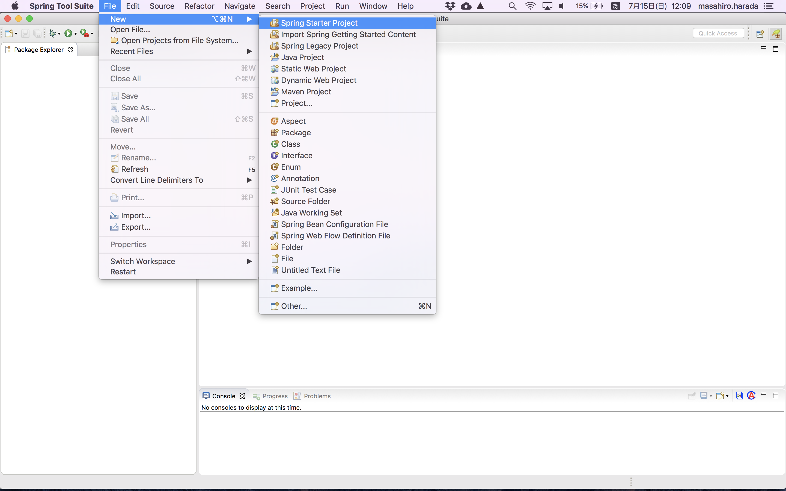
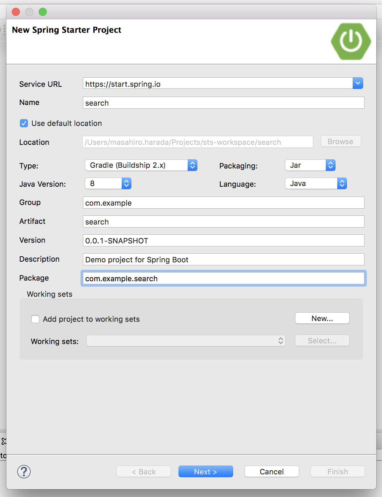
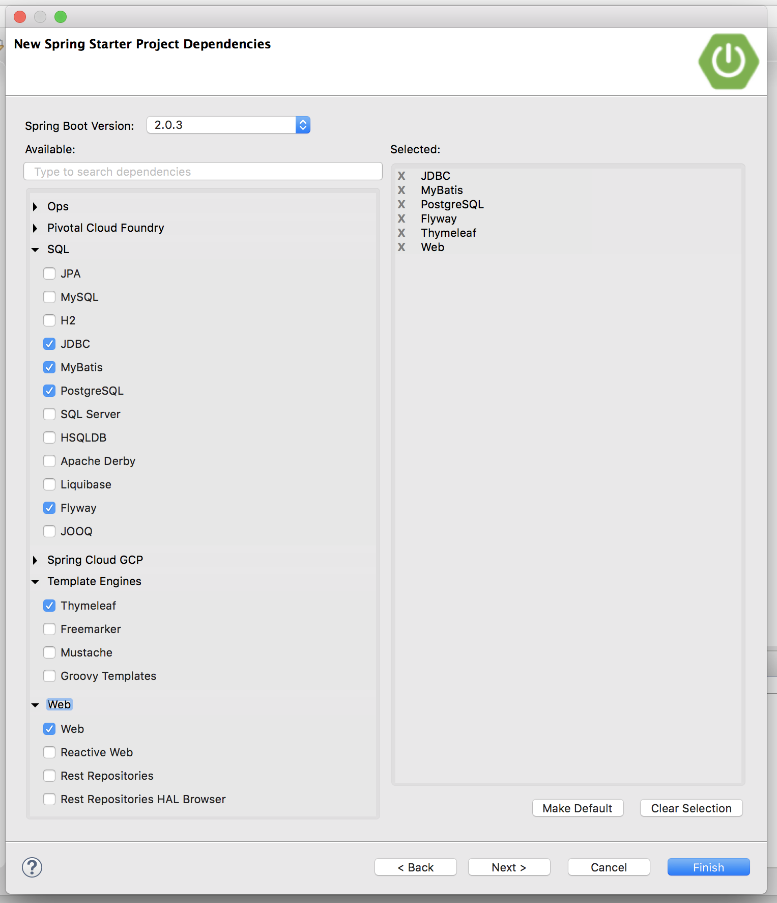

# プロジェクトの新規作成

メニュー「File」→「New」→「Spring Starter Project」

設定ダイアログが開きます。

以下の項目を編集してください。

* 「Name」（プロジェクトの名前）：「search」
* 「Type」（ビルドツールの種類）：「Gradle (Buildship 2.x)」
* 「Artifact」（ビルドされた成果物の名前）：「search」
* 「Package」（パッケージ名）：「com.example.search」

（「search」ってなに？と思われるかもしれませんが、次章のチュートリアルで作成するアプリケーションの名前です。ここで作るプロジェクトを次章でも引き続き使いたいのでこの名前を入力してください。）

上記の通り設定できたら「Next >」をクリックします。

続いて、導入するライブラリを選択します。Spring は最初からすべての機能が備わっているわけではなく、必要に応じてライブラリを選定して組み合わせて使うフレームワークなのですね。

以下の通りライブラリを選択してください。

* SQL
    * **JDBC**：データベースを操作する
    * **MyBatis**：OR マッパー（後述）
    * **PostgreSQL**：PostgreSQL に接続するため
    * **Flyway**：マイグレーション（後述）
* Template Engines
    * **Thymeleaf**：テンプレートエンジン（後述）
* Web
    * **Web**：ルーティングなど Web アプリの基本機能

指定に抜けや誤りがないことを確認して「Finish」をクリックしてください。

ダイアログが閉じて最初の画面に戻ります。画面右下に実行中のタスクが表示されますので、何も表示されなくなったらプロジェクトの作成が完了したということです。
