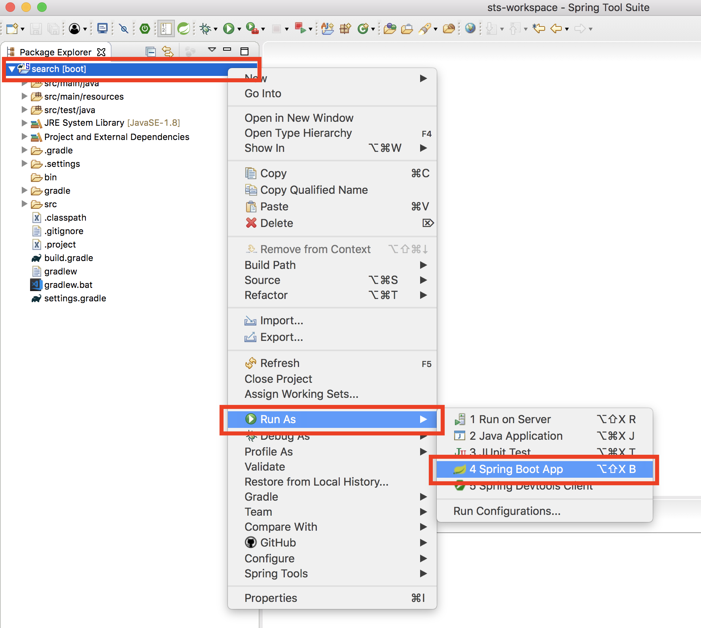
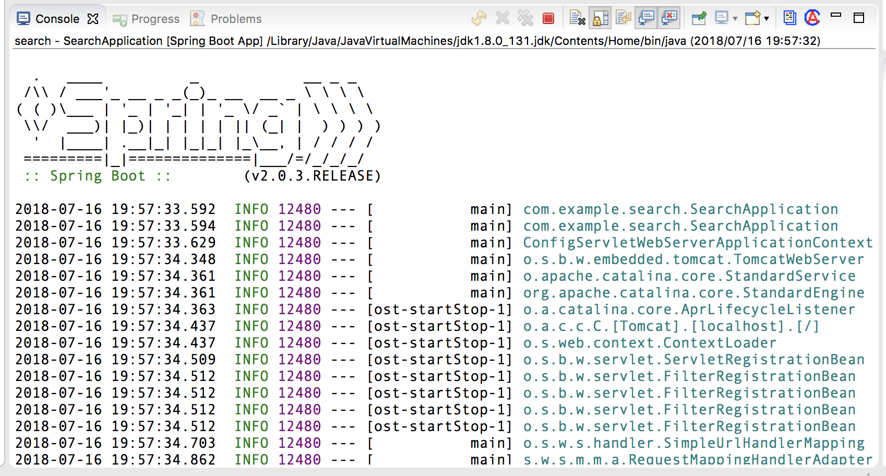
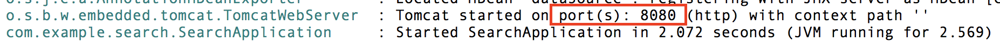
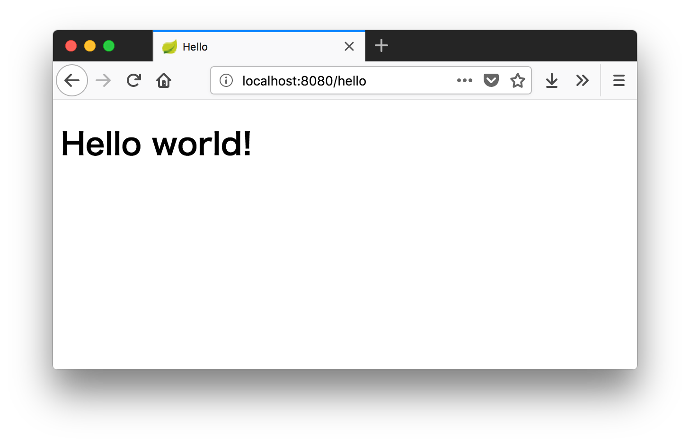

# アプリを起動する

コードが揃ったので、アプリケーションを起動しましょう。

Package Explorer の最上位「search」を右クリックするとメニューが表示されますので、「**Run As**」→「**4 Spring Boot App**」を選択してください。

コンソール欄に以下のようにログが出力されます。

最後に次のようなログが出力されていれば起動成功です。

赤線で囲っているように 8080 ポートで起動しているので、http://localhost:8080/hello にアクセスしましょう。

Hello world! 画面が表示されたでしょうか！？

以上でこの章はおしまいです。次章からもう少し本格的なアプリケーションを使ったチュートリアルが始まります。
