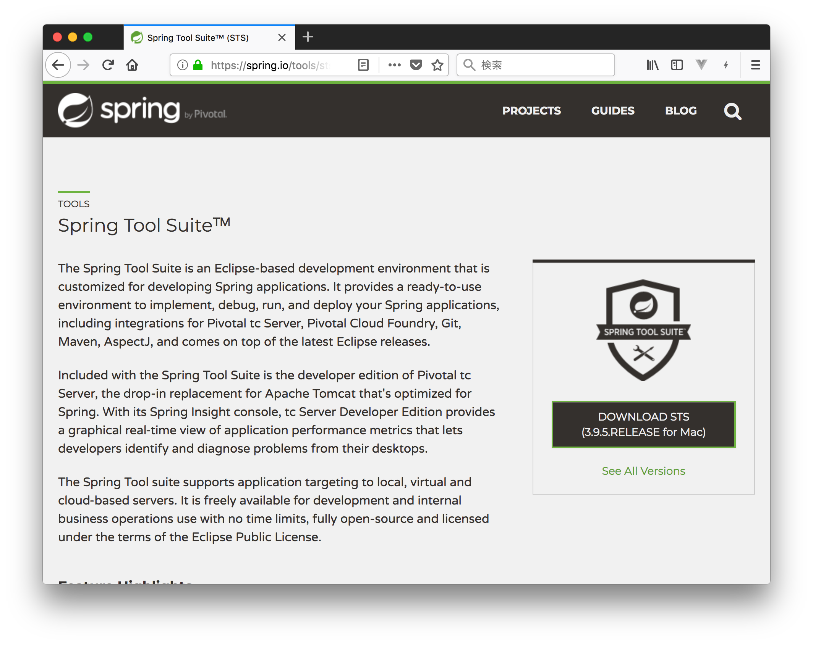

# STS（Spring Tool Suite）

## STS とは

Spring Boot で Web アプリケーション開発を学ぶにあたって、STS という統合開発環境（IDE）を使用します。

Eclipse をベースに、Spring アプリケーションを開発しやすくするための機能が追加されたものだと思ってください。IDE としての操作は Eclipse とほぼ同じです。

## インストール

[こちらのページ](https://spring.io/tools/sts)からダウンロードしてください。



Windows 版ではダウンロードした zip ファイルを解凍するとどこかのフォルダに ```STS.exe``` があるはずですので、そちらをダブルクリックすると STS が起動します。

## ワークスペース

STS を起動するとはじめにワークスペースの場所を聞かれます。


Eclipse のワークスペースと同じで、開発したアプリケーションのソースコードを配置するディレクトリです。あとで見失わないように、わかりやすい場所を指定しておきましょう。

例えば私はユーザーディレクトリに ```Projects``` というディレクトリを作成して、その下にすべてのアプリケーションコードをプロジェクトごとにまとめています。今回は ```Projects``` の下に ```sts-workspace``` というディレクトリを作成してそちらをワークスペースに指定しました。

皆さんもそれぞれ管理しやすい場所に指定してください。
